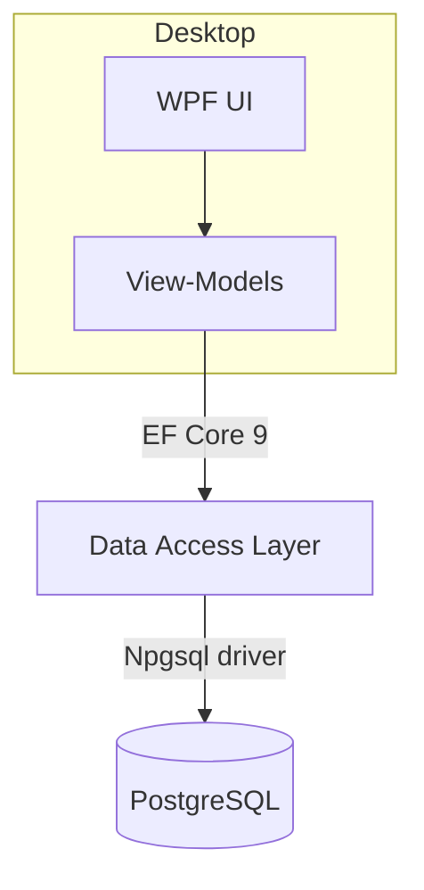
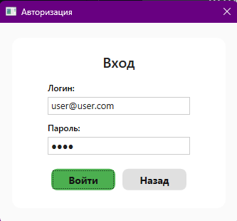
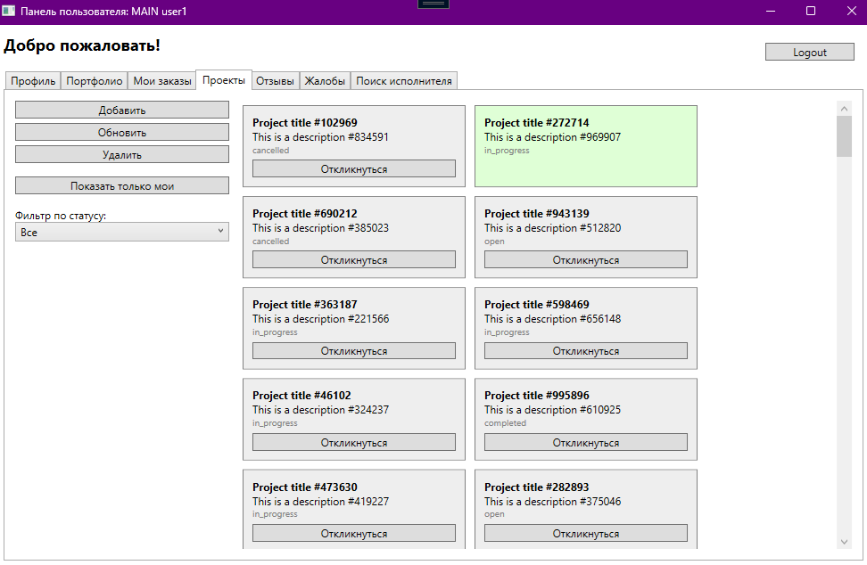

# FreelanceApp – WPF + PostgreSQL


> **Курсовой проект** по дисциплине “Базы данных”.
> Настольное приложение‑биржа фриланса, написанное на **WPF (.NET 9)** c использованием **PostgreSQL** и **Entity Framework Core**.

---

## 📑 Оглавление

- [О проекте](#о-проекте)
- [Возможности](#возможности)
- [Стек технологий](#стек-технологий)
- [Архитектура](#архитектура)
- [Скриншоты](#скриншоты)
- [Быстрый старт](#быстрый-старт)
- [Структура репозитория](#структура-репозитория)
- [Работа с базой данных](#работа-с-базой-данных)

## О проекте

**FreelanceApp** моделирует процесс взаимодействия заказчиков и исполнителей на бирже фриланса:
CRUD‑операции с проектами и предложениями, роли (admin / moderator / user), базовая метрика производительности и аудит операций.

## Возможности

- Регистрация и аутентификация с rôлями пользователей
- Управление проектами, заявками, портфолио и отзывами
- Модерация жалоб (роль _moderator_)
- Просмотр отчётов и аудит действий (роль _admin_)
- Генерация >100 000 строк тестовых данных для нагрузочного тестирования
- Локализация интерфейса (RU / EN)
- Современный MVVM‑UI с Material‑элементами

## Стек технологий

| Слой | Технологии                                                    |
| ---- | ------------------------------------------------------------- |
| UI   | WPF (.NET 9), Material Design in XAML, CommunityToolkit.Mvvm  |
| DAL  | Entity Framework Core 9, Npgsql, Repository + Unit‑of‑Work    |
| DB   | PostgreSQL 15+, PL/pgSQL, JSONB, триггеры, хранимые процедуры |

## Архитектура



## Скриншоты

| Login                                | Dashboard                                    |
| ------------------------------------ | -------------------------------------------- |
|  |  |

## Быстрый старт

<details>
<summary>📦 Клонирование и подготовка</summary>

```bash
# 1. Клонируем репозиторий
git clone https://github.com/your‑account/freelance‑app.git
cd freelance‑app

# 2. Устанавливаем зависимости nuget
dotnet restore app/app.sln
```

</details>

<details>
<summary>🐘 Настройка PostgreSQL (одной командой)</summary>

```bash
# создаём БД и роли
psql -U postgres -f db/init.sql
# (опционально) аудит и процедуры
psql -U postgres -f db/procedures.sql
```

Все исходные SQL‑скрипты лежат в директории **/db**.

</details>

<details>
<summary>🚀 Запуск приложения</summary>

```bash
# из корня репозитория
dotnet run --project app/FreelanceApp
```

По умолчанию строка подключения берётся из _app/FreelanceApp/appsettings.json_.
Измените параметры `Host`, `Username`, `Password`, если ваши настройки БД отличаются.

</details>

## Структура репозитория

```text
course_2_2/
├── app/               # исходный код (.sln, WPF, DAL)
│   ├── FreelanceApp/  # UI‑проект
│   └── DAL/           # Data‑access layer + миграции
├── db/                # SQL‑скрипты создания и наполнения базы
├── note/              # ER‑диаграммы, UML, документация
├── docs/              # прочие файлы
└── README.md
```

## Работа с базой данных

| Скрипт                         | Описание                                                       |
| ------------------------------ | -------------------------------------------------------------- |
| `db/init.sql`                  | Полное создание схемы `core`, таблиц, ролей и первичных данных |
| `db/audit.sql`                 | Триггеры и таблицы аудита                                      |
| `db/procedures.sql`            | Полезные отчётные функции (пример — `core.get_schema_report`)  |
| `db/generate_100_000_strs.sql` | Гибкая генерация большого объёма тестовых строк                |

💡 _Entity Framework_ не используется для миграций — база версионируется через явные SQL‑скрипты, что упрощает контроль и проверку.
